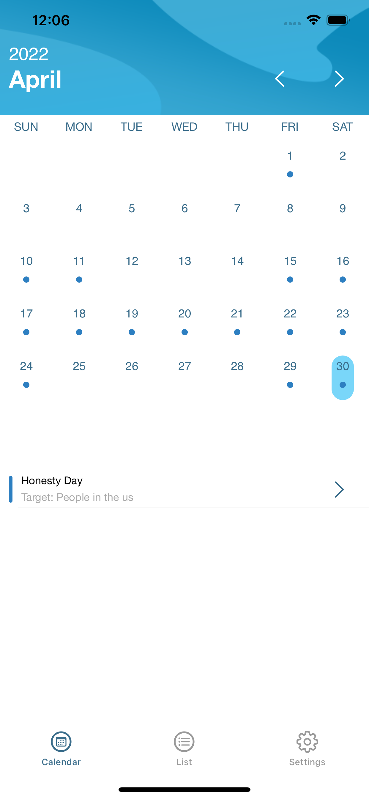
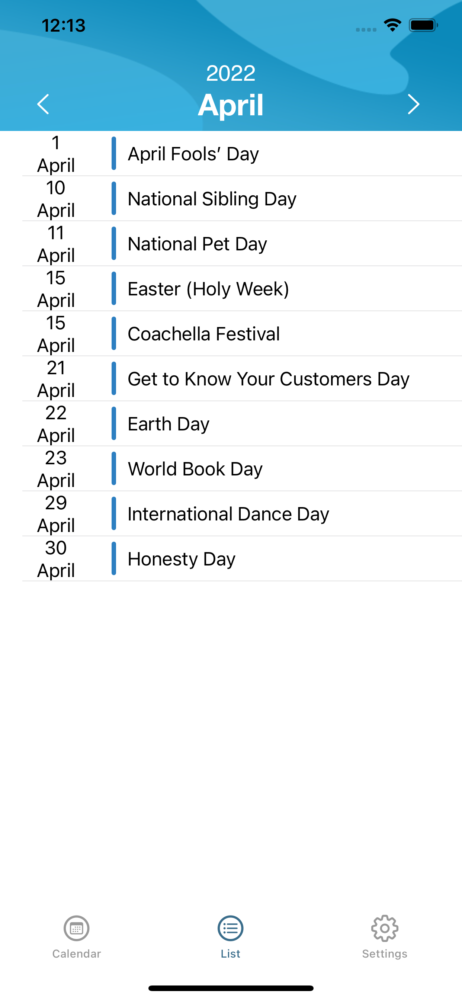
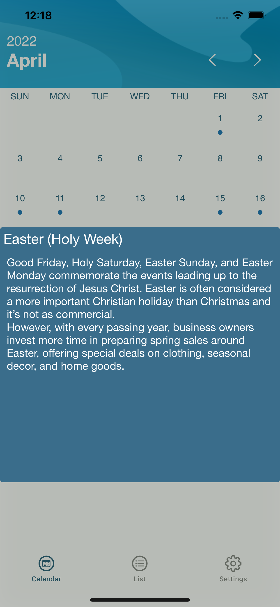
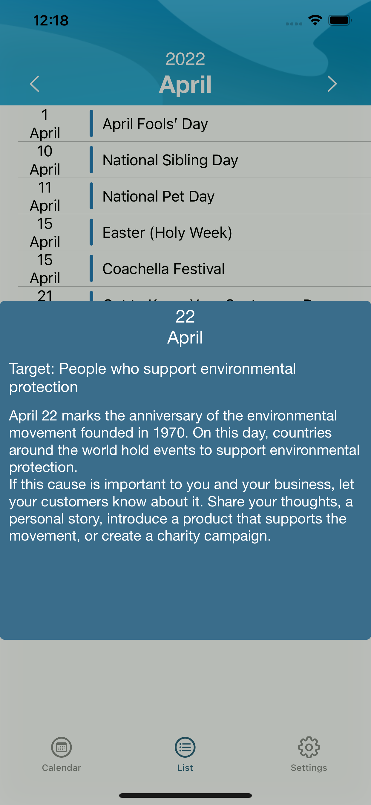

## Welcome to E-Commerce Holiday Calendar App

E-commerce Holiday Calendar is an online calendar application 
where you can easily find various international special days 
which celebrates around the world. It was designed for 
targeting special days and events for sellers, 
especially those who are interested in E-commerce.

     
     
     
     

Nowadays, E-commerce takes a huge place in marketing. So, if you want to be more successful and expand your online business, this app will be helpful to keep up with the latest events and specify your items through the exact customers. With this app, you can easily and quickly prepare your market for the next events. 

**Key features**

- Holiday and special days names and dates

- Targets

- Descriptions

- Monthly list view

### Support or Contact

Questions? Feel free to [email us](mailto:incidogukann@gmail.com?subject=About%20E%20Commerce%20Holiday%20Calendar) and we’ll help you sort it out.

### Privacy Policy and Terms

For privacy policy go to [privacy policy](https://github.com/dogukaninci/E-commerce-Holiday-Calendar/blob/gh-pages/Privacy%20Policy.md)
For Terms go to [terms](https://github.com/dogukaninci/E-commerce-Holiday-Calendar/blob/gh-pages/Terms.md)
